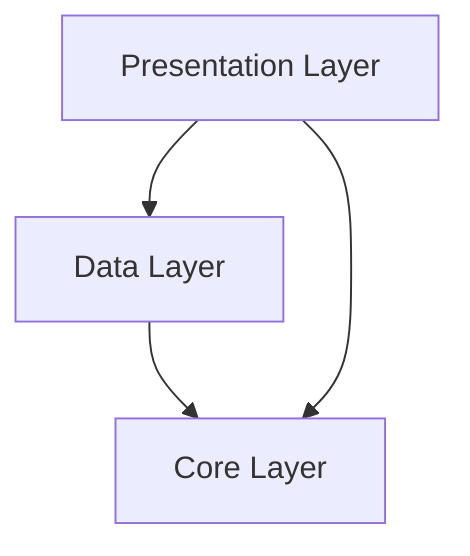
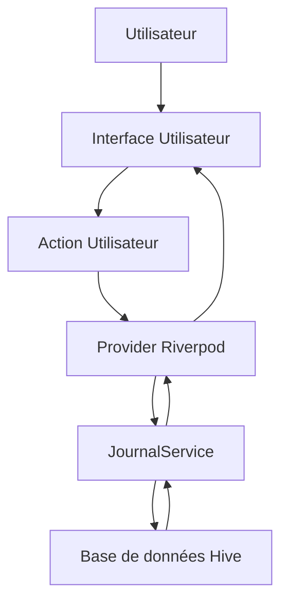

# Documentation de l'application CNV Coach

Cette documentation a pour but de fournir une compréhension approfondie de l'architecture, des technologies et du fonctionnement de l'application CNV Coach, afin de faciliter sa maintenance et son évolution.

## 1. Introduction

L'application CNV Coach est un outil mobile (et potentiellement desktop/web) développé avec Flutter, visant à aider les utilisateurs à pratiquer la Communication NonViolente (CNV). Elle propose un journal pour enregistrer des situations selon le processus CNV (Observation, Sentiment, Besoin, Demande), ainsi que des exercices pratiques et des ressources.

**Fonctionnalités principales :**
*   **Journal CNV** : Enregistrement et consultation d'entrées structurées.
*   **Parcours d'ajout d'entrée** : Un flux guidé pour créer une nouvelle entrée de journal.
*   **Exercices pratiques** : Des activités interactives pour s'entraîner aux principes de la CNV.
*   **Ressources** : Accès à des informations complémentaires sur la CNV.

## 2. Structure du projet Flutter

Le projet suit une structure standard Flutter, avec une organisation modulaire au sein du dossier `lib/`.

```
cnv_coach/
├── android/              # Fichiers spécifiques à la plateforme Android
├── ios/                  # Fichiers spécifiques à la plateforme iOS
├── lib/                  # Code source de l'application Flutter
│   ├── core/             # Éléments fondamentaux et transversaux
│   │   ├── constants/    # Constantes de l'application (données d'exercices, etc.)
│   │   └── theme.dart    # Définition du thème visuel de l'application
│   ├── data/             # Couche de gestion des données
│   │   ├── models/       # Modèles de données (ex: JournalEntry)
│   │   └── services/     # Services de persistance ou d'API (ex: JournalService)
│   ├── presentation/     # Couche de présentation (UI)
│   │   ├── providers/    # Providers Riverpod pour la gestion d'état
│   │   ├── screens/      # Écrans de l'application
│   │   └── widgets/      # Widgets réutilisables
│   └── main.dart         # Point d'entrée de l'application et configuration principale
├── pubspec.yaml          # Dépendances et métadonnées du projet
├── README.md             # Description générale du projet
└── ... (autres fichiers de configuration et de build)
```

**Dossier `lib/` détaillé :**
*   **`core/`**: Contient les éléments fondamentaux et transversaux de l'application.
    *   `constants/`: Fichiers contenant des données statiques ou des constantes utilisées à travers l'application, comme `exercises_data.dart`.
    *   `theme.dart`: Définit le thème visuel global de l'application (`ThemeData`, `ColorScheme`, etc.).
*   **`data/`**: Gère la logique d'accès et de manipulation des données.
    *   `models/`: Définit les structures de données de l'application, comme `journal_entry.dart` pour les entrées du journal. Ces modèles sont souvent annotés pour la génération de code (ex: Hive).
    *   `services/`: Contient les services responsables de l'interaction avec les sources de données (base de données locale, API, etc.). `journal_service.dart` est un exemple pour la gestion des entrées du journal.
*   **`presentation/`**: Contient la couche d'interface utilisateur.
    *   `providers/`: Fichiers définissant les providers Riverpod pour la gestion de l'état de l'application. `journal_providers.dart` gère l'état lié au journal.
    *   `screens/`: Chaque fichier représente un écran distinct de l'application (ex: `home_screen.dart`, `journal_screen.dart`, `exercises_screen.dart`). Les écrans sont souvent organisés en sous-dossiers pour des flux spécifiques (ex: `entry_flow/`).
    *   `widgets/`: Contient des widgets Flutter réutilisables qui ne sont pas des écrans complets.
*   **`main.dart`**: Le fichier principal qui initialise l'application, configure les dépendances (Hive, Riverpod), la navigation (GoRouter) et lance l'interface utilisateur.

## 3. Technologies utilisées

L'application s'appuie sur les technologies suivantes :

*   **Flutter** : Framework UI multiplateforme.
*   **Dart** : Langage de programmation de Flutter.
*   **GoRouter** (`go_router`) : Gestionnaire de navigation déclaratif.
*   **Flutter Riverpod** (`flutter_riverpod`) : Gestionnaire d'état réactif.
*   **Hive** (`hive`, `hive_flutter`) : Base de données locale rapide.
*   **Hive Generator** (`hive_generator`) : Générateur d'adaptateurs Hive.
*   **Lucide Icons** (`lucide_icons`) : Bibliothèque d'icônes vectorielles.
*   **uuid** (`uuid`) : Générateur d'identifiants uniques.
*   **intl** (`intl`) : Outil d'internationalisation.

## 4. Architecture de l'application

L'application suit une architecture modulaire, séparant les préoccupations en différentes couches :



*   **Presentation Layer (Couche de Présentation)** : Contient l'interface utilisateur (widgets, écrans) et la logique de présentation. Elle est responsable de l'affichage des données et de la gestion des interactions utilisateur. Elle utilise les `providers` de Riverpod pour accéder aux données et à la logique métier.
*   **Data Layer (Couche de Données)** : Gère la récupération, le stockage et la manipulation des données. Elle contient les `services` (ex: `JournalService`) qui interagissent avec les sources de données (ex: Hive). Elle expose des interfaces pour la couche de présentation.
*   **Core Layer (Couche Fondamentale)** : Contient les éléments transversaux et les utilitaires qui peuvent être utilisés par toutes les autres couches, tels que le thème de l'application, les constantes, les modèles de données purs (sans logique de persistance spécifique).

## 5. Flux de données

Le flux de données dans l'application est principalement unidirectionnel, géré par Riverpod et Hive.



**Explication du flux :**
1.  **`User`** interagit avec l'**`UI`** (par exemple, remplit un formulaire pour une nouvelle entrée de journal).
2.  L'**`UI`** déclenche une **`Action Utilisateur`** (par exemple, appelle une méthode sur un `JournalService` via un `Provider`).
3.  Le **`Provider Riverpod`** (ex: `journalEntriesProvider` ou un provider qui expose des méthodes pour modifier le journal) est notifié ou utilisé pour interagir avec le service.
4.  Le **`JournalService`** effectue l'opération nécessaire (ex: `addEntry`, `getEntries`).
5.  Le `JournalService` interagit avec la **`Base de données Hive`** pour lire ou écrire des données.
6.  Après l'opération, le `JournalService` renvoie les données (ou un statut) au **`Provider`**.
7.  Le **`Provider`** met à jour son état, ce qui notifie l'**`UI`** qui écoute ce provider.
8.  L'**`UI`** se reconstruit automatiquement pour refléter les nouvelles données.

## 6. Gestion de l'état (Flutter Riverpod)

Riverpod est utilisé pour la gestion de l'état de l'application. Il offre un moyen sûr et performant de partager l'état entre les widgets.

*   **`ProviderScope`** : Le widget `ProviderScope` est placé au sommet de l'arbre des widgets (`main.dart`) pour rendre les providers disponibles dans toute l'application.
*   **`Provider`** : Un `Provider` est un objet qui encapsule une partie de l'état ou une dépendance.
    *   **`journalServiceProvider`** : Un `Provider<JournalService>` qui expose l'instance du `JournalService`. Il est initialisé et surchargé dans `main.dart` avec l'instance réelle du service après l'initialisation de Hive.
    *   **`journalEntriesProvider`** : Un `Provider<List<JournalEntry>>` qui expose la liste actuelle des entrées du journal. Il dépend de `journalServiceProvider` pour obtenir le service et appelle `getEntries()`. Les widgets peuvent "écouter" ce provider pour réagir aux changements de la liste des entrées.

**Interaction avec les providers :**
*   Pour lire un provider dans un widget : `ref.watch(someProvider)` (pour écouter les changements) ou `ref.read(someProvider)` (pour lire une fois).
*   Pour modifier l'état géré par un provider (si c'est un `StateNotifierProvider` ou similaire), on appelle les méthodes exposées par le notifier. Dans le cas de `journalEntriesProvider`, il est actuellement en lecture seule, mais un `StateNotifierProvider` pourrait être utilisé pour exposer des méthodes `addEntry`, `deleteEntry`, etc., qui mettraient à jour la liste et notifieraient les écouteurs.

## 7. Navigation (GoRouter)

GoRouter est utilisé pour gérer la navigation au sein de l'application, offrant une approche déclarative et basée sur les URL.

*   **Configuration dans `main.dart`** : Toutes les routes sont définies dans l'objet `_router` de type `GoRouter`.
*   **`ShellRoute`** : Utilisé pour les écrans qui partagent une mise en page commune (comme une `BottomNavigationBar`). Dans cette application, `MainScaffold` est le shell qui contient la navigation principale (`/`, `/journal`, `/exercises`, `/resources`).
*   **`GoRoute`** : Définit une route spécifique avec un chemin (`path`) et un constructeur de widget (`builder`).
    *   Exemple : `GoRoute(path: '/', builder: (context, state) => const HomeScreen())`
*   **Navigation** : Pour naviguer, on utilise `context.go('/path')` pour remplacer la pile de navigation ou `context.push('/path')` pour ajouter une route à la pile.

## 8. Persistance des données (Hive)

Hive est la solution de persistance locale choisie pour sa rapidité et sa simplicité.

*   **Initialisation** : `Hive.initFlutter()` est appelé dans `main.dart` avant `runApp()`.
*   **`JournalEntry` Model** : Le modèle `JournalEntry` (`lib/data/models/journal_entry.dart`) est annoté avec `@HiveType` et `@HiveField` pour indiquer comment il doit être stocké par Hive.
*   **`hive_generator`** : Le fichier `journal_entry.g.dart` est généré automatiquement par `flutter packages pub run build_runner build` et contient l'adaptateur nécessaire à Hive pour sérialiser/désérialiser `JournalEntry`.
*   **`JournalService`** : (`lib/data/services/journal_service.dart`) est la classe qui encapsule toute la logique d'interaction avec Hive pour les entrées du journal. Elle ouvre une "boîte" Hive (`_journalBox`) et fournit des méthodes CRUD (`getEntries`, `addEntry`, `deleteEntry`, `updateEntry`).
*   **`NotificationService`** : (`lib/data/services/notification_service.dart`) centralise l'initialisation de `flutter_local_notifications`, la demande de permissions et la planification/annulation des rappels liés aux `CalendarEvent` (conversions via le package `timezone`).

## 9. Thème de l'application

Le thème visuel de l'application est centralisé dans `lib/core/theme.dart`.

*   **`AppTheme`** : Une classe statique qui contient les définitions de thèmes.
*   **`lightTheme`** : Un objet `ThemeData` qui configure les couleurs (`ColorScheme`), le style de l'AppBar (`AppBarTheme`), le style des cartes (`CardThemeData`), les boutons (`ElevatedButtonThemeData`) et la barre de navigation inférieure (`BottomNavigationBarThemeData`).
*   **`useMaterial3: true`** : Indique que l'application utilise les composants et les directives de design de Material 3.

## 10. Comment maintenir l'application

Pour toute personne souhaitant maintenir ou faire évoluer cette application, voici quelques directives :

*   **Comprendre le flux général** :
    *   Commencez toujours par `main.dart` pour voir l'initialisation et la configuration globale.
    *   Suivez les routes définies dans `GoRouter` pour comprendre la structure de navigation.
    *   Pour un écran donné, identifiez les providers Riverpod qu'il utilise pour comprendre d'où viennent ses données et comment il interagit avec la logique métier.
    *   Explorez les services (`data/services/`) pour comprendre comment les données sont persistées ou récupérées.

*   **Ajouter une nouvelle fonctionnalité (ex: un nouvel exercice)** :
    1.  **Modèle de données (si nécessaire)** : Créez ou modifiez un modèle dans `lib/data/models/`. Si c'est un modèle Hive, n'oubliez pas les annotations `@HiveType` et `@HiveField`.
    2.  **Service de données (si nécessaire)** : Créez un nouveau service ou ajoutez des méthodes à un service existant dans `lib/data/services/` pour gérer la persistance de ce modèle.
    3.  **Génération de code** : Si vous avez modifié un modèle Hive, exécutez `flutter packages pub run build_runner build` pour générer les fichiers `.g.dart` mis à jour.
    4.  **Provider Riverpod** : Créez un nouveau provider dans `lib/presentation/providers/` pour exposer les données ou la logique métier liée à votre fonctionnalité.
    5.  **Écran/Widgets UI** : Créez les écrans et widgets nécessaires dans `lib/presentation/screens/` et `lib/presentation/widgets/`. Utilisez `ref.watch` ou `ref.read` pour interagir avec vos providers.
    6.  **Navigation** : Ajoutez une nouvelle `GoRoute` dans `main.dart` pour votre nouvel écran.
    7.  **Thème** : Assurez-vous que votre nouvelle UI respecte le thème défini dans `lib/core/theme.dart`.

*   **Débogage** :
    *   Utilisez les outils de développement Flutter (Flutter DevTools) pour inspecter l'arbre des widgets, surveiller les performances, inspecter l'état des providers Riverpod, et déboguer le code.
    *   Les messages `print()` et les points d'arrêt dans votre IDE sont vos meilleurs amis.

*   **Mises à jour des dépendances** :
    *   Vérifiez régulièrement les versions obsolètes avec `flutter pub outdated`.
    *   Mettez à jour les dépendances avec `flutter pub upgrade` ou `flutter pub upgrade --major-versions` (avec prudence pour les versions majeures).

*   **Génération de code** :
    *   Chaque fois que vous modifiez un modèle Hive ou d'autres fichiers nécessitant une génération de code (comme Freezed, Json Serializable, etc.), exécutez :
        ```bash
        flutter packages pub run build_runner build
        ```
    *   Pour surveiller les changements et générer automatiquement :
        ```bash
        flutter packages pub run build_runner watch
        ```

Cette documentation devrait servir de guide solide pour comprendre et maintenir l'application CNV Coach.

## 11. Ressources sur la CNV

### Comprendre la Communication NonViolente

La Communication NonViolente (CNV) est une approche relationnelle proposée par Marshall B. Rosenberg qui vise à créer un dialogue empathique fondé sur la compréhension mutuelle des besoins. Elle favorise une communication respectueuse, l'écoute active et la recherche de solutions coopératives. Le processus se structure autour de quatre composantes complémentaires :

1.  **Observation** – décrire les faits sans jugement ni interprétation afin de créer un terrain neutre de discussion.
2.  **Sentiments** – nommer ce qui est vécu intérieurement pour clarifier son expérience émotionnelle.
3.  **Besoins** – identifier les aspirations profondes ou valeurs nourrissant ces sentiments.
4.  **Demande** – formuler une action concrète, positive et réalisable qui pourrait contribuer à nourrir les besoins exprimés.

Ces étapes servent de guide pour structurer les échanges, accueillir l'autre avec empathie et prendre soin de la relation tout en restant fidèle à ses propres besoins.

### Pour aller plus loin

Pour approfondir vos connaissances sur la Communication NonViolente, voici une sélection de ressources fiables :

*   **Livres**
    *   *Les mots sont des fenêtres (ou bien ce sont des murs)* – Marshall B. Rosenberg : l'ouvrage de référence pour comprendre les principes fondateurs de la CNV.
    *   *La Communication NonViolente au quotidien* – Marshall B. Rosenberg et Lucy Leu : un guide pratique pour intégrer la CNV dans sa vie personnelle et professionnelle.
*   **Sites web**
    *   [Centre pour la Communication NonViolente (CNVC)](https://www.cnvc.org/) : site officiel de l'organisation fondée par Marshall Rosenberg, avec des ressources, formations et annuaire des formateurs certifiés.
    *   [ACNV France](https://www.cnvformations.fr/) : association francophone proposant un calendrier des formations, des articles et des supports pédagogiques.
*   **Contenus multimédias**
    *   [Chaîne YouTube « Communication NonViolente »](https://www.youtube.com/@CommunicationNonviolente) : conférences et ateliers enregistrés autour de la pratique de la CNV.
    *   [Podcast « Pratiquer la Communication NonViolente »](https://open.spotify.com/show/5kB5RwP0J3JXqCmqyIZnZU) : témoignages et mises en situation pour appliquer la CNV au quotidien.

Ces ressources permettent d'aller plus loin dans la compréhension théorique et pratique de la CNV et peuvent être partagées avec les utilisateurs de l'application pour accompagner leur progression.
